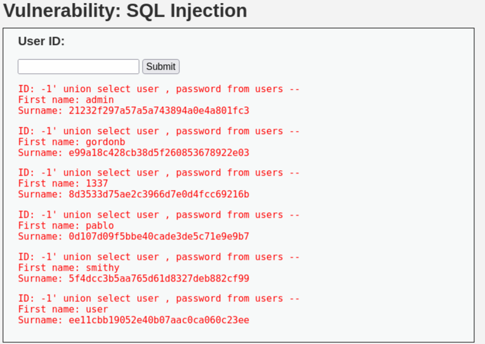

# SQL Injection Vulnerability Assessment Report
## Damn Vulnerable Web Application (DVWA)

---

## 1. Executive Summary
This report documents the identification and exploitation of an SQL Injection
vulnerability within Damn Vulnerable Web Application (DVWA). The vulnerability
allows manipulation of backend SQL queries, resulting in unauthorized access
to sensitive database information.

---

## 2. Scope & Environment
- Application Name: Damn Vulnerable Web Application (DVWA)
- Vulnerable Module: SQL Injection
- Environment Type: Local Lab Environment
- Deployment Stack: Apache / PHP / MySQL
- Security Level: Low
- Testing Authorization: Authorized testing for educational purposes only

---

## 3. Vulnerability Overview
- Vulnerability Type: SQL Injection
- Injection Technique: UNION-based SQL Injection
- OWASP Category: A03:2021 – Injection
- CWE ID: CWE-89
- Severity: Critical

---

## 4. Affected Component
- Page: SQL Injection
- Input Field: User ID
- HTTP Method: GET
- Vulnerable Parameter: `id`
- Backend Database: MySQL

---

## 5. Technical Description
The application dynamically constructs SQL queries by directly concatenating
user-supplied input into the SQL statement without proper validation or
sanitization.

This flaw allows an attacker to manipulate the intended SQL query logic.
By leveraging a UNION-based SQL Injection technique, additional database tables
and columns can be queried beyond the original query scope.

---

## 6. Proof of Concept (PoC)
The vulnerability was successfully exploited by injecting crafted input into
the `id` parameter of the SQL Injection module.

This manipulation resulted in the disclosure of data from the `users` table,
including usernames and password hashes, confirming unauthorized data access.

> Note: All data shown originates from a deliberately vulnerable test
> application (DVWA). Passwords are displayed as hashed values and are included
> strictly for demonstration purposes.

---

## 7. Impact Assessment
If exploited in a real-world production environment, this vulnerability could
allow an attacker to:
- Extract sensitive user credentials
- Enumerate database structure
- Bypass authentication mechanisms
- Fully compromise the backend database

Such an attack could lead to severe data breaches and loss of system integrity.

---

## 8. CVSS v3.1 Score (Estimated)
- Base Score: 9.1 (Critical)
- Attack Vector: Network
- Attack Complexity: Low
- Privileges Required: None
- User Interaction: None
- Confidentiality Impact: High
- Integrity Impact: High
- Availability Impact: Low

---

## 9. Remediation Recommendations
To mitigate this vulnerability, the following countermeasures are recommended:
- Use parameterized queries (Prepared Statements)
- Implement strict server-side input validation
- Avoid dynamic SQL query construction
- Apply the principle of least privilege to database accounts
- Perform regular security testing and code reviews

---

## 10. Lessons Learned
This assessment highlights the importance of secure coding practices and
demonstrates how improper input handling can lead to critical vulnerabilities
such as SQL Injection.

---

## 11. References
- OWASP Top 10 2021 – Injection  
- OWASP SQL Injection Prevention Cheat Sheet  
- CWE-89: SQL Injection  

---

## 12. Disclaimer
This report was created solely for educational and portfolio demonstration
purposes. All testing activities were conducted in a controlled and authorized
lab environment using Damn Vulnerable Web Application (DVWA).

